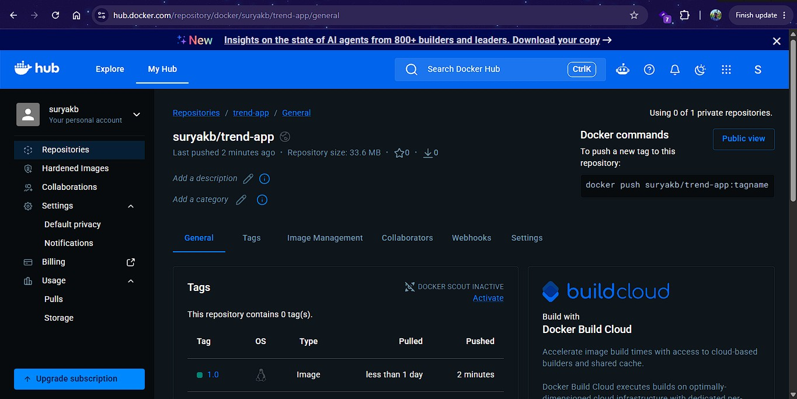
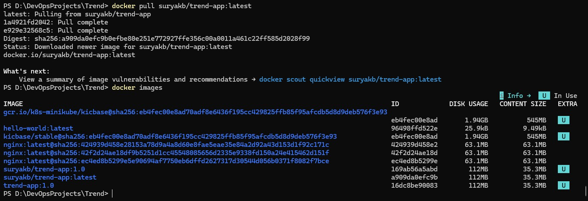
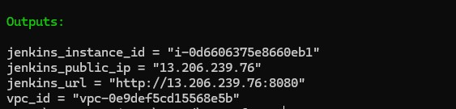
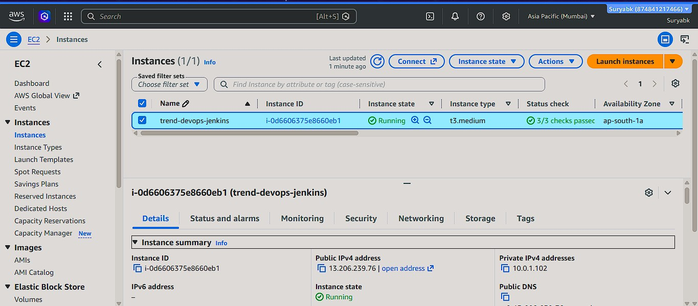
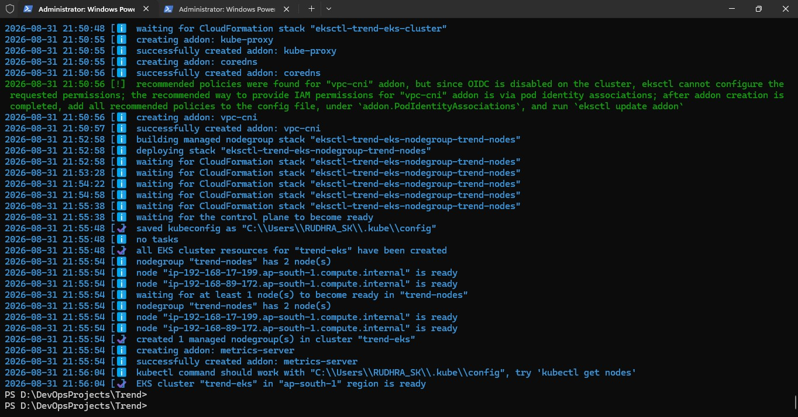
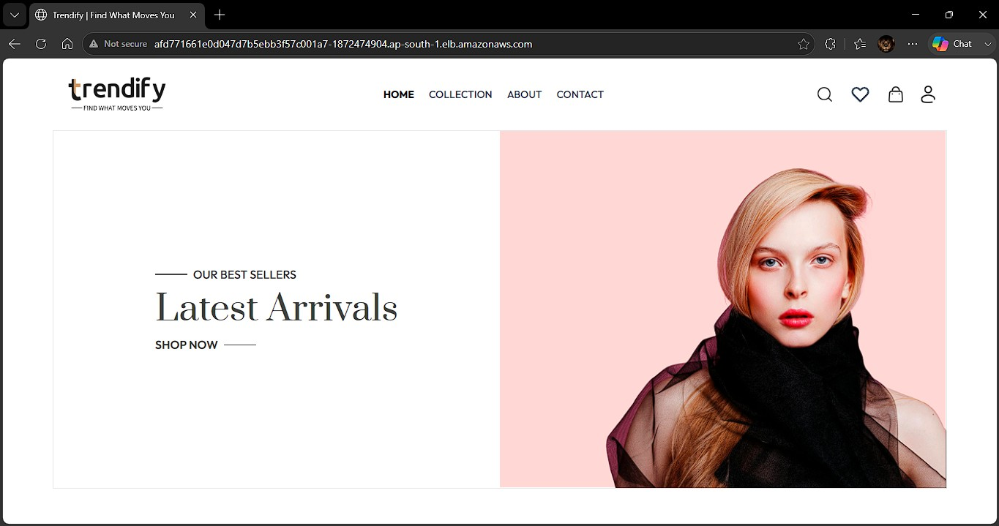
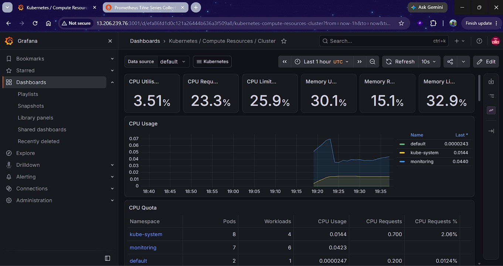
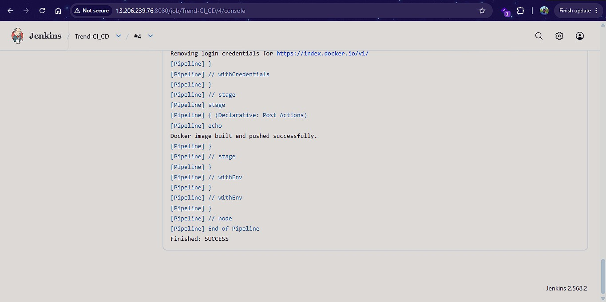

# Trendify -- End-to-End AWS DevOps Project


## 📌 Project Overview

**Trendify** is a containerized web application deployed on AWS using a
complete DevOps workflow.

The project demonstrates how source code can move from a developer
workstation through Docker image creation, Docker Hub, Jenkins CI/CD,
Terraform-provisioned AWS infrastructure, Amazon EKS, Kubernetes, and
finally to a publicly accessible LoadBalancer endpoint.

It also includes **Prometheus/Grafana-based Kubernetes monitoring** for
observing cluster and workload resource utilization.

------------------------------------------------------------------------

## 🎯 Project Objectives

-   Containerize the Trendify application using Docker.
-   Build and version Docker images.
-   Push application images to Docker Hub.
-   Provision AWS infrastructure using Terraform.
-   Configure an EC2 instance as a Jenkins server.
-   Implement Jenkins CI/CD automation.
-   Deploy the application to Amazon EKS.
-   Manage application replicas using Kubernetes Deployment.
-   Expose the application through a Kubernetes LoadBalancer.
-   Add monitoring using Prometheus and Grafana.
-   Demonstrate an end-to-end production-style DevOps workflow.

------------------------------------------------------------------------

## 🏗️ Architecture

``` text
                    Developer
                        |
                        v
                 Application Code
                        |
                        v
                    Docker
                        |
                        v
              Docker Hub Repository
                        |
                        v
              Jenkins on AWS EC2
                        |
              +---------+---------+
              |                   |
              v                   v
        Docker Build/Push      Kubernetes
                                  |
                                  v
                            Amazon EKS
                                  |
                         +--------+--------+
                         |                 |
                    Deployment          Service
                         |            LoadBalancer
                         |                 |
                      2 Pods               v
                         |          Public AWS ELB
                         |                 |
                         +----------------> Trendify
                                            |
                                            v
                                     End User Browser

Monitoring:
Amazon EKS / Kubernetes
        |
        v
Prometheus
        |
        v
Grafana
        |
        v
CPU / Memory / Cluster / Workload Dashboards
```

------------------------------------------------------------------------

## 🛠️ Technology Stack

  Category                  Technology
  ------------------------- -----------------------------------
  Application               Trendify Web Application
  Cloud                     AWS
  Compute                   EC2
  Containerization          Docker
  Image Registry            Docker Hub
  CI/CD                     Jenkins
  Infrastructure as Code    Terraform
  Container Orchestration   Kubernetes
  Kubernetes Platform       Amazon EKS
  Load Balancing            Kubernetes LoadBalancer / AWS ELB
  Monitoring                Prometheus
  Visualization             Grafana
  OS                        Amazon Linux
  Version Control           Git / GitHub

------------------------------------------------------------------------

# 🔄 End-to-End DevOps Workflow

## Phase 1 -- Application Validation

The application was first verified locally to ensure the Trendify web
application was working correctly before containerization.


------------------------------------------------------------------------

## Phase 2 -- Docker Containerization

A Docker image was created for the Trendify application.

Example:

``` bash
docker build -t trend-app:1.0 .
```

The application was then tested locally using Docker.

> **Note:** If port `3000` is already occupied, use another host port,
> for example:
>
> ``` bash
> docker run -d --name trend-test -p 3001:3000 trend-app:1.0
> ```

------------------------------------------------------------------------

## Phase 3 -- Docker Hub

The application image was tagged and pushed to Docker Hub.

Example:

``` bash
docker tag trend-app:1.0 suryakb/trend-app:1.0
docker push suryakb/trend-app:1.0
```

Docker Hub repository verification:



The image was also successfully pulled from Docker Hub:



------------------------------------------------------------------------

# ☁️ AWS Infrastructure

## Phase 4 -- Terraform

Terraform was used to provision and manage the AWS infrastructure.

Typical workflow:

``` bash
terraform init
terraform validate
terraform plan
terraform apply
```

Terraform apply verification:



### Infrastructure responsibilities

Terraform was used to support infrastructure such as:

-   VPC
-   Subnets
-   Security groups
-   EC2
-   IAM-related configuration
-   Supporting AWS resources

Using Infrastructure as Code makes the environment repeatable and easier
to maintain.

------------------------------------------------------------------------

# ⚙️ Jenkins CI/CD

## Phase 5 -- Jenkins Server

Jenkins was hosted on an AWS EC2 instance.



Jenkins was configured to automate the application build and deployment
workflow.

------------------------------------------------------------------------

## Phase 6 -- Automated Jenkins Build

The Jenkins pipeline was configured to perform automated build
activities.

Typical flow:

``` text
Source Code
    ↓
Jenkins
    ↓
Docker Build
    ↓
Docker Image Tag
    ↓
Docker Hub Push
    ↓
Kubernetes Deployment
```

Successful Jenkins build:


------------------------------------------------------------------------

# ☸️ Amazon EKS and Kubernetes

## Phase 7 -- EKS Cluster

An Amazon EKS cluster named `trend-eks` was created in the `ap-south-1`
region.

The cluster and managed node group were successfully created.



The cluster was validated with:

``` bash
kubectl get nodes
```

Expected result:

``` text
NAME                                            STATUS   ROLES
ip-192-168-17-199.ap-south-1.compute.internal   Ready    <none>
ip-192-168-89-172.ap-south-1.compute.internal   Ready    <none>
```

------------------------------------------------------------------------

## Phase 8 -- Kubernetes Deployment

The Trendify application was deployed to EKS using a Kubernetes
Deployment.

Example validation:

``` bash
kubectl get deployments
kubectl get pods
```

The application was running with **2 replicas**.

``` text
trend-app   2/2   2   2
```

Pods were verified as healthy:

``` text
trend-app-7bbc6974f4-8wmc7   1/1   Running
trend-app-7bbc6974f4-qdtld   1/1   Running
```

Jenkins deployment pipeline verification:


------------------------------------------------------------------------

# 🌐 Application Exposure

## Phase 9 – Kubernetes LoadBalancer

The Trendify application was exposed through a Kubernetes `LoadBalancer` service on Amazon EKS.

Validation:

```bash
kubectl get svc
```

The service was confirmed as:

```text
trend-service   LoadBalancer
```

Port mapping:

```text
80:30976/TCP
```

Target port:

```text
3000
```

### AWS LoadBalancer Details

| Property | Value |
|---|---|
| Kubernetes Service | `trend-service` |
| Service Type | `LoadBalancer` |
| Load Balancer Type | **Classic Elastic Load Balancer (Classic ELB)** |
| AWS Region | `ap-south-1` |
| Port | `80` |
| Target Port | `3000` |
| NodePort | `30976` |
| Load Balancer Name | `afd771661e0d047d7b5ebb3f57c001a7` |
| Load Balancer DNS | `afd771661e0d047d7b5ebb3f57c001a7-1872474904.ap-south-1.elb.amazonaws.com` |

### LoadBalancer Verification

The Classic ELB was verified using the AWS CLI:

```bash
aws elb describe-load-balancers   --region ap-south-1   --query "LoadBalancerDescriptions[?DNSName=='afd771661e0d047d7b5ebb3f57c001a7-1872474904.ap-south-1.elb.amazonaws.com'].[LoadBalancerName,DNSName]"   --output table
```

The application endpoint was tested successfully:

```bash
curl -I http://afd771661e0d047d7b5ebb3f57c001a7-1872474904.ap-south-1.elb.amazonaws.com
```

Expected/observed response:

```text
HTTP/1.1 200 OK
Server: nginx/1.31.4
```

> **Important:** This Kubernetes service created a **Classic Elastic Load Balancer**. Classic ELB resources do not have an ARN exposed through the ELBv2 API. Therefore, the Load Balancer name and DNS endpoint are documented instead of an ARN. The `aws elbv2 describe-load-balancers` command correctly returned no ELBv2 resources because this is a Classic ELB.



# 📊 Monitoring

## Phase 10 -- Prometheus + Grafana

Monitoring was added to the Kubernetes environment using **Prometheus
and Grafana**.

Grafana was used to visualize:

-   Cluster CPU utilization
-   Cluster memory utilization
-   CPU requests
-   CPU limits
-   Memory requests
-   Memory limits
-   Namespace resource consumption
-   Kubernetes workload information

Monitoring dashboard:



Example observed namespaces:

``` text
kube-system
monitoring
default
```

The monitoring layer provides visibility into the health and resource
utilization of the EKS environment.

------------------------------------------------------------------------

# 🔍 Validation Commands

## Check EKS Cluster

``` bash
aws eks describe-cluster \
  --region ap-south-1 \
  --name trend-eks \
  --query 'cluster.status' \
  --output text
```

Expected:

``` text
ACTIVE
```

## Check Nodes

``` bash
kubectl get nodes
```

## Check Deployments

``` bash
kubectl get deployments
```

## Check Pods

``` bash
kubectl get pods
```

## Check Services

``` bash
kubectl get svc
```

## Check Application Image

``` bash
kubectl get deployment trend-app \
  -o jsonpath='{.spec.template.spec.containers[*].image}'
```

## Check Rollout

``` bash
kubectl rollout status deployment/trend-app
```

## Check Service Details

``` bash
kubectl describe svc trend-service
```

------------------------------------------------------------------------

# 📸 Project Evidence

### 1. Application Running Locally


### 2. Application Running on Jenkins / EC2 / EKS Environment


### 3. Application Through AWS LoadBalancer


### 4. Docker Hub Repository


### 5. Docker Image Pull


### 6. EKS Cluster Ready


### 7. EKS Deployment Pipeline


### 8. Jenkins Automated Build



### 9. Jenkins EC2 Server


### 10. Grafana Monitoring


### 11. Terraform Apply


------------------------------------------------------------------------

# 🔐 DevOps / Security Practices Demonstrated

-   IAM roles instead of hard-coded AWS credentials where possible.
-   Least-privilege access principles.
-   Docker image versioning.
-   Infrastructure as Code with Terraform.
-   Kubernetes declarative configuration.
-   Replica-based application deployment.
-   Automated CI/CD through Jenkins.
-   Centralized monitoring and visualization.
-   Separation between infrastructure provisioning and application
    deployment.

------------------------------------------------------------------------

# 🚀 Key Project Outcomes

By completing this project, the following workflow was demonstrated:

``` text
Code
 ↓
Docker
 ↓
Docker Hub
 ↓
Jenkins
 ↓
AWS EC2
 ↓
Amazon EKS
 ↓
Kubernetes Deployment
 ↓
Kubernetes LoadBalancer
 ↓
Public Application
 ↓
Prometheus
 ↓
Grafana Monitoring
```

The final application was successfully deployed and accessible through
an AWS LoadBalancer, with **2 Kubernetes replicas running on EKS** and
**Grafana monitoring the Kubernetes environment**.

------------------------------------------------------------------------

# 🧹 Cleanup / Cost Control

When the project is no longer required, remember to remove billable AWS
resources.

For Terraform-managed infrastructure:

``` bash
terraform destroy
```

For EKS resources created outside Terraform, delete them separately.

Also verify that no unnecessary:

-   EC2 instances
-   EKS clusters
-   LoadBalancers
-   NAT Gateways
-   Elastic IPs
-   EBS volumes

are still running.

------------------------------------------------------------------------

# ✅ Final Project Status

  Component               Status
  ----------------------- ---------------------------
  Application             ✅ Working
  Docker Image            ✅ Built
  Docker Hub              ✅ Image Available
  Terraform               ✅ Infrastructure Applied
  Jenkins EC2             ✅ Running
  Jenkins CI/CD           ✅ Successful
  EKS Cluster             ✅ Active
  EKS Nodes               ✅ Ready
  Kubernetes Deployment   ✅ 2/2 Ready
  Kubernetes Pods         ✅ Running
  LoadBalancer            ✅ Accessible
  Prometheus              ✅ Configured
  Grafana                 ✅ Dashboard Working
  Project Documentation   ✅ Completed

------------------------------------------------------------------------

## ⭐ Final Architecture Summary

**Trendify is now a complete portfolio-level DevOps project covering:**

**Infrastructure → Containerization → CI/CD → Kubernetes → AWS EKS →
Load Balancing → Monitoring**

This README and the included screenshots can be added directly to the
project's GitHub repository as the final documentation.


# 📦 Final Submission Checklist

Before submitting the project, verify that the GitHub repository contains:

```text
Trend/
├── README.md
├── Dockerfile
├── Jenkinsfile
├── .gitignore
├── .dockerignore
├── nginx.conf
├── terraform/
├── k8s/
└── screenshots/
```

### Evidence to submit

- GitHub repository link
- README.md
- Docker Hub repository/image
- Terraform infrastructure code
- Jenkinsfile and successful Jenkins pipeline
- EKS cluster and node evidence
- Kubernetes Deployment and Pods
- Kubernetes LoadBalancer service
- Verified LoadBalancer DNS
- LoadBalancer name (Classic ELB)
- Prometheus/Grafana monitoring screenshot
- Screenshots folder

### Final LoadBalancer Information

```text
Load Balancer Type: Classic Elastic Load Balancer
Region: ap-south-1
Name: afd771661e0d047d7b5ebb3f57c001a7
DNS: afd771661e0d047d7b5ebb3f57c001a7-1872474904.ap-south-1.elb.amazonaws.com
Port: 80
Target Port: 3000
```

The application returned `HTTP 200 OK` through the public LoadBalancer endpoint.
